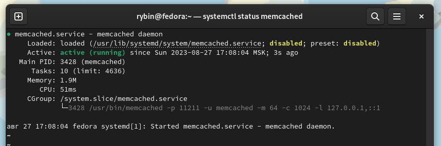
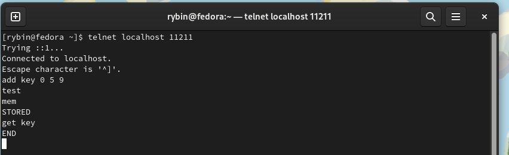
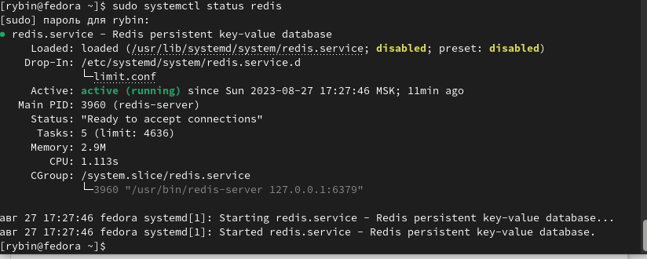
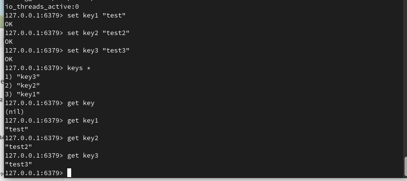

# Redis_memcached
### Задание 1

1. Приведите примеры проблем, которые может решить кеширование.  

Повышение производительности достигается за счет складывания в кэш данных, к которым чаще всего происходит обращение;

● Увеличение скорости ответа;

● Экономия ресурсов базы данных, например, применяя кэширование тяжелых запросов;

● Сглаживание бустов трафика. Например, во время черной пятницы онлайн-магазины используют кэш, чтобы переживать резкое увеличение трафика.

Кэширование это очень мощный и простой в использовании механизм, который позволяет значительно увеличить производительность системы. Если вы планируете использовать кэш, то стоит внимательно посмотреть на то какие данные вы хотите кэшировать и как они используются. От этого зависит эффективность решения и какую стратегию выбрать.

---

### Задание 2

1. Установите и запустите memcached.  

  

---

### Задание 3

1. Запишите в memcached несколько ключей с любыми именами и значениями, для которых выставлен TTL 5.  

  

---

### Задание 4

1. Запишите в Redis несколько ключей с любыми именами и значениями  

  

  

---
